# Build Your Own Website from Scratch Workshop

This workshop contains the following activities:
* Interact with HTML, CSS and JavaScript code as the foundation of website code
* Setup a Wordpress instance on **000Webhost** with a free account
* Create and deploy your new Wordpress website on 000Webhost

Goal: Get a flavour of the various website development and analysis tools that exist

## Setup
* Create a free account on https://repl.it

* Create a 'free account' on 000Webhost - https://www.000webhost.com/

* Create a free Google account, which will be used for Google Analytics

## HTML, CSS and JS (JavaScript)
We are going to interact with the various key code components of websites using `repl.it`. HTML (structure) + CSS (style) + JS (interaction)  = webpage

We are going to create a custom travel blog website from scratch! **Everyone picks a city or country to visit**

> At the bottom of `https://repl.it` after you've setup your account, select the language `HTML, CSS, JS` for your new repl:


> Update the name of your page and give it a description (e.g. `sampleWebsite` as in the following screenshot):

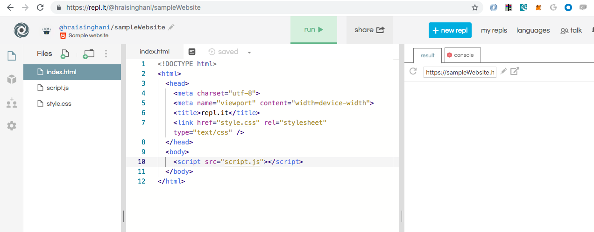

When you run the boilerplate website code, your website is running on a custom domain - `https://sampleWebsite.hraisinghani.repl.co` in the above case. Our website is live in real-time on the internet!

Also in terms of the repl layout, we have the file directory and package manager in our left window pane, our code in the middle, and the output on the right - both the graphical visual output of our website in the 'result' tab and any specific code output or logging in our 'console' tab. 

### HTML
To cover:
* `html`, `head`, `body`, `script`s
* `h1`, `h2`, `h3`, `<p>`, ``, `<hr>`, `<br>`
* Adding style:
  * inline
  * `<style></style>` in the HTML `head`
* Concept of `div`s
* Elements and Classes

#### Boilerplate code
```
<!DOCTYPE html>
<html>
  <head>
    <meta charset="utf-8">
    <meta name="viewport" content="width=device-width">
    <title>Sample Website</title>
    <link href="style.css" rel="stylesheet" type="text/css" />
  </head>
  <body>
    <script src="script.js"></script>
  </body>
</html>
```
* Elements are types of HTML items that can be used in an HTML file, such as headings (`h1`), paragraphs (`p`). For a full list of elements, see https://developer.mozilla.org/en-US/docs/Web/HTML/Element.

* Element references inside of `<>` are called **tags**. For example, `<p>`, `<h1>`, `<head>`, `<body>`.

* Most elements require both an opening and closing tag.

Some key elements in our template code:
* `<!DOCTYPE html>` - tells browsers which version of HTML is used
  
* `<html></html>` - HTMl root element contains one `<head>` and one `<body>` element.
  
* `<head></head>` - a container element that can contain a number of sub-elements which are either metadata or pull in external resources like CSS stylesheets. Sub-element tags we will use are `<title></title>` (which is always required), `<style></style>` for adding some custom styling and `<link></link>` for our pulling in our CSS (which is the way you should pull in custom styling)
  
* `<body></body>` -  the container which holds all the content of the document. Also contains sub-elements like `<script></script>` to pull in external resources.

> Modify the `<title></title>` element of your website

> Add in the following into the `<body></body>` element:
* A heading level 1: `<h1> Your Header </h1>`
* A 2 x sub-heading level 2: `<h2>Secondary Header </h2>`

* Add Two paragraphs: `<p> Your paragraph text </p>`

* An image from the web (unsplash.com): `
  * Note the features on an image tag:
    * The `src` of the image. It could be a website or a local file
    * The dimensions of the picture
  * Can also download an image file, upload it to repl.it and source it as `src='image.jpg'` for example. 

```

```

* A web link to another site: `<a href="https://example.com"> Text for your Link </a>` . For example:
```
<p> Check out my list of favourite things to see in Sydney <a href="https://www.planetware.com/tourist-attractions-/sydney-aus-nsw-s.htm">here!</a>
```

> Now add in a video using an `<iframe>` element. We can easily add in video from say YouTube by using the *embed code* and adding that to our iframe element as follows:
```
<iframe width="905" height="509" src="https://www.youtube.com/embed/0hm9stchT8E" frameborder="0" allow="accelerometer; autoplay; encrypted-media; gyroscope; picture-in-picture" allowfullscreen></iframe>
```


The `<div></div>` tags represent a container unit which help divide the HTML document and group together elements into sections. Think of a div as a fundamental unit container that you can build ontop (i.e. containers within containers)

> Add `<div></div>` tags around each of your paragraphs. For example, the first paragraph could be an intro paragraph and the second a section on travel. 

> Add a `<div></div>` tag around all the elements in our `<body>`. This will essentially be our master container. 

#### Box Model

All HTML elements can be considered as boxes. In CSS, the term "box model" is used when talking about design and layout.

The CSS box model is essentially a box that wraps around every HTML element. It consists of: margins, borders, padding, and the actual content. The image below illustrates the box model:

https://www.w3schools.com/css/css_boxmodel.asp

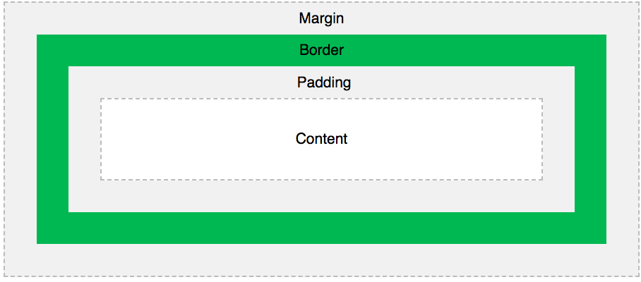

### CSS (for Styling)
There is an ocean of knowledge on the subject of CSS and best practices. For an intro tutorial, see: https://www.w3schools.com/css/css_intro.asp 

We'll only touch upon the basics here.

#### Inline Styling
An inline CSS is used to apply a unique style to a single HTML element:

`<h1 style="color:blue;">This is a Blue Heading</h1>`

> Apply inline CSS to your paragraph element

#### Internal CSS
An internal CSS is defined in the `<head>` section of an HTML page within a `<style>` element:
```
<head>
    <style>
        body {background-color: powderblue;}
        h1   {color: blue;}
        p    {color: red;}
    </style>
</head>
```
> Apply internal CSS to your h1 element.

#### External CSS file
An external style sheet is used to define the style for many HTML pages.

With an external style sheet, you can change the look of an entire web site, by changing one file!

To use an external style sheet, add a `<link>` element to it in the `<head>` section of the HTML page:

```
<head>

    <link href="style.css" rel="stylesheet" type="text/css" />
</head>
```

#### Classes vs. IDs
* Classes - used to denote multiple elements that will receive the same styling. In the HTML code, classes are denoted using the element keyword `class` in an HTML element:

```
<div class="introduction-section">
```

* IDs - are unique and can apply to only one element on the page:
```
<div class="introduction-section">
    <p id="flight-details"> .... </p>
</div>
```

In your external CSS file (i.e. `style.css`), class names are referenced with a `.` and id names with a `#`:
```
.introduction-section {
    color: red;
}

#flight-details {
    color: blue;
}
```

> Replace any inline and internal CSS styling with external CSS defined in `style.css`.

### Bootstrap
Bootstrap (https://getbootstrap.com/) is one of the most popular front-end libraries in the world! It contains templates for standardizing things such as the overall website grid and components. 

To get started: https://getbootstrap.com/docs/4.4/getting-started/introduction/

Let's start by adding the Bootstrap styling or CSS to our website. Simply copy the following into the header before applying our custom `style.css` styling:
```
<link rel="stylesheet" href="https://stackpath.bootstrapcdn.com/bootstrap/4.4.1/css/bootstrap.min.css" integrity="sha384-Vkoo8x4CGsO3+Hhxv8T/Q5PaXtkKtu6ug5TOeNV6gBiFeWPGFN9MuhOf23Q9Ifjh" crossorigin="anonymous">
```
Q) Why do we put this before our custom css file?

Normally you also add in the JavaScript code in the `<body>` before your custom `script.js` file but we won't get into that here.

* Note how our styling changes as we add the Bootstrap code! But our custom changes are still maintained given the order the stylesheets are loaded in.


#### Bootstrap Grid System

One of the more powerful aspects of Bootstrap is its inherent grid system. We won't get into much of the details, but here's a quick example to help explain the concept:

https://getbootstrap.com/docs/4.4/layout/grid/#how-it-works

Also for individual reading - https://css-tricks.com/snippets/css/a-guide-to-flexbox/#flexbox-background

Bootstrap effectively divides the webpage into a max of 12 columns.

> Add the `container` class to the master `<div>` and then create 1 row and then 3 columns within that row, like in the example, and **add images** to each of the 3 column div's. 
```
<div class="container">
  <div class="row">
    <div class="col-sm">
      One of three columns
    </div>
    <div class="col-sm">
      One of three columns
    </div>
    <div class="col-sm">
      One of three columns
    </div>
  </div>
</div>
```

The above example creates three equal-width columns on small, medium, large, and extra large devices using our predefined grid classes. Those columns are centered in the page with the parent .container.

#### Inspect tools using Chrome

* Can visualize the overall grid system as well as the margin, border and padding. The Inspect tool is very powerful, and also allows you to go to other websites, and see what underlying styling they use if you want to use some of their color palettes or elements, etc..


### JS
* Used to add behaviour to your webpage
* For example, be able to access document elements and update them
* Internal JavaScript is added using the `<script></script>` element tags in either the `<head>` or `<body>`
* 

Example (from w3schools.com):
```
<!DOCTYPE html>
<html>
<head>
    <script>
    function myFunction() {
        document.getElementById("demo").innerHTML = "Paragraph changed.";
    }
    </script>
</head>
<body>
    <h2>JavaScript in Head</h2>

    <p id="demo">A Paragraph.</p>

    <button type="button" onclick="myFunction()">Try it</button>
</body>
</html>
```

### Add Website tracking (e.g. Google Analytics)
Tracking websites provides useful insights into what pages your users are viewing, for how long, from where, etc.. Here, we'll add a simple Google Analytics code snippet to track our demo Repl.it website.

> Use your Google Account to sign into Google Analytics at https://analytics.google.com/web/

> Under the `Admin` panel, create a `New Account` to track a website. Enter in an Account Name, your Website Name and use the URL of our demo Repl.it website (e.g. https://samplewebsite.hraisinghani.repl.co/).  

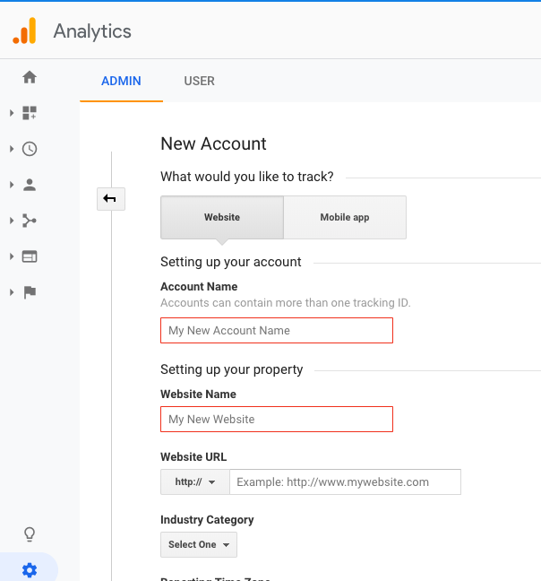

> Uncheck all the Data Sharing Settings and click on `Get Tracking ID`. You'll get a code snipped containing your Google Analytics tracking ID. Simply copy and paste this piece of code into your `<head>` element:

```
<head>
    <!-- Global site tag (gtag.js) - Google Analytics -->
    <script async src="https://www.googletagmanager.com/gtag/js?id=UA-141780281-1"></script>

    <script>
      window.dataLayer = window.dataLayer || [];
      function gtag(){dataLayer.push(arguments);}
      gtag('js', new Date());

      gtag('config', 'UA-141780281-1');
    </script>
    ...
</head>
```
> Now open up a few incognito tabs and go to your website. Observe what happens on your Google Analytics Home dashboard!

There is a **ton** of information in Google Analytics so have fun exploring all the interesting data available!

## Using a Wordpress Hosting Site
Wordpress is probably the most popular website building framework in the world and allows you to build quickly using templates and a graphical interface. You can also use your own html/css code to some degree. 

### Setup with 000webhost

> Sign-up using your email. Will need to verify your address.

> Enter (or skip) the first two on-barding steps until you get to `Create Your Website` screen:


> Then, create a `WordPress Website`:

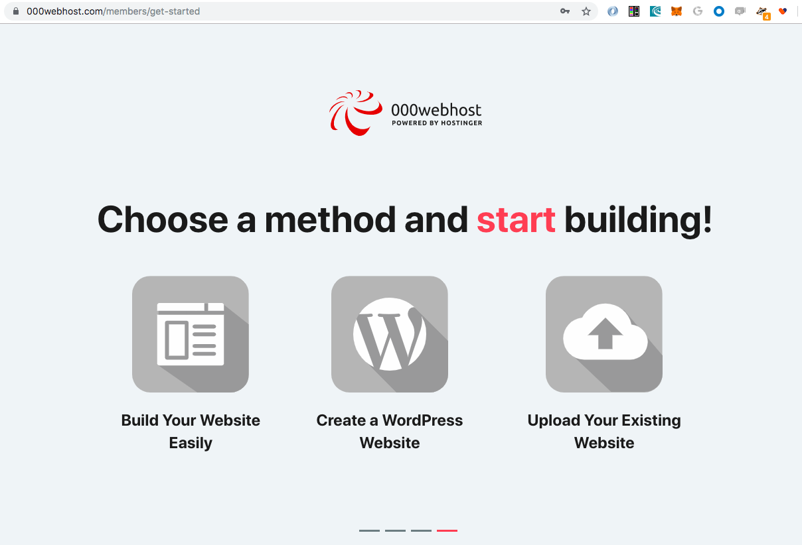


> You will then be prompted to install WordPress on your hosted instance:

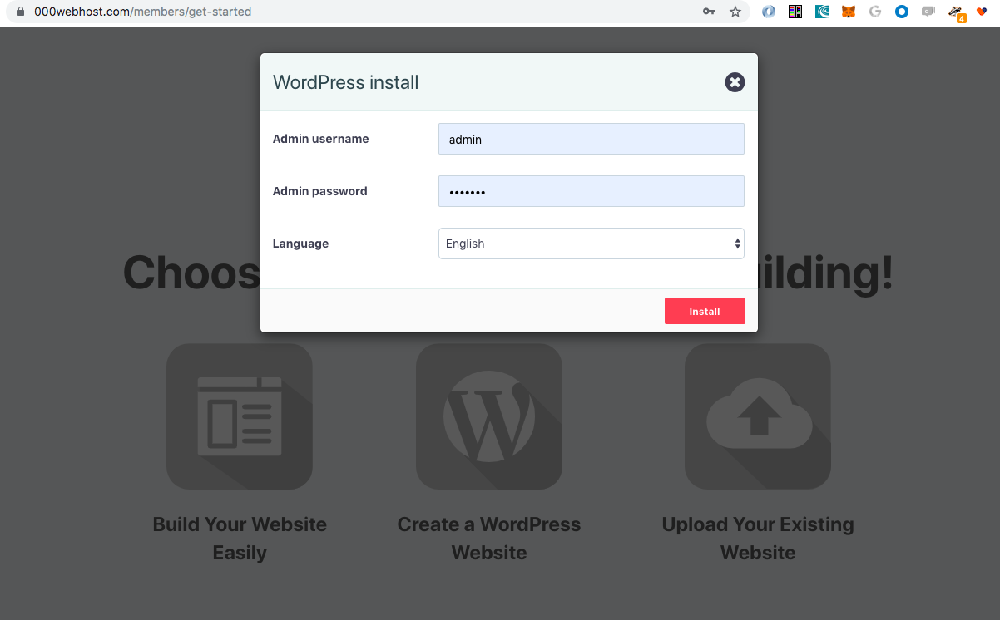

> Once completed, log into your WordPress admin portal to the configuration page:

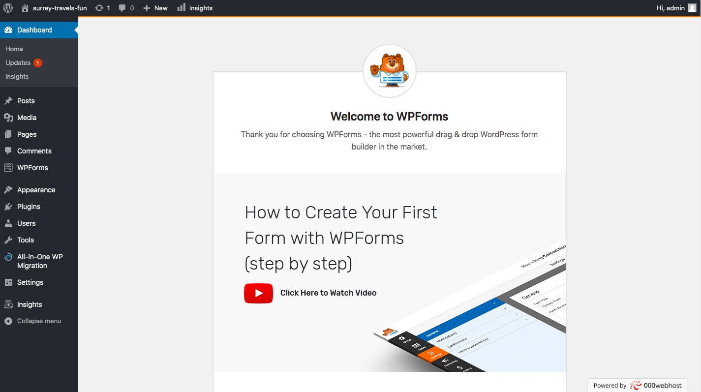

> Also go to your hosted URL to see your newborn website! For example, mine is https://surrey-travels-fun.000webhostapp.com/:

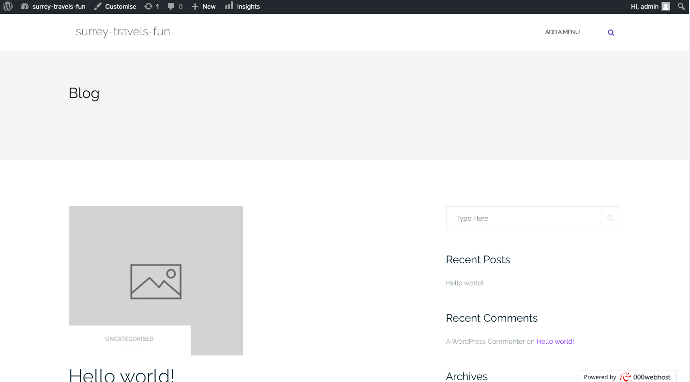


### Using Wordpress

Overall goal:
* Walk users how to get started by look at the overall structure of the pages (terms, references)

* Then start by changing the hi-vis stuff like the header, background and footer images

* Add some content or a blog post

* Let participants build their own website.

### Menu items

#### Dashboard
This will display your main Dashboard *homepage*. In the top left of your Dashboard you’ll see some brief stats on the number of Posts, Pages, Categories and Tags contained within your site, as well as the total number of comments and approved comments. There’s also a summary of how many Spam Comments you currently have.

**Go here if you ever get lost in WordPress!**

#### Settings
This is where your site is configured. Among other things, it allows you to configure your site name and URL , where your Posts appear, whether people can leave Post Comments or not and numerous other settings. Most times, once your site is setup, there's no need to change any of the settings within this section.

> Under *Settings -> General*, update your `Tagline`, `timezone` and any other general settings

#### Appearance
This menu is where you control how your site looks. You can choose a new Theme, manage your site Widgets or Menus and even edit your site theme files.

> Select and activate a new theme such as `twenty-twenty`. Note our options are currently limited with this free offering of Wordpress but you can find themes online and upload here to use.  

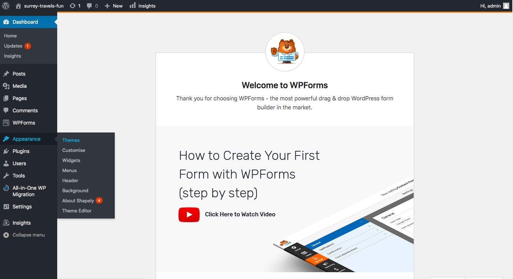
 
Then explore the *background* menu option and select an image. 
Use pictures from https://unsplash.com/

Also explore:
* Widgets
* Menus

#### Media
This is where all your uploaded images, documents or files are stored. You can browse through your Media library, as well as edit and update the files.

> If you haven't already added some media, add some pictures now (you can use pictures from https://unsplash.com)

#### Posts
This is where you can create a new Blog Post. You can also update your Categories and Post Tags.

> Create a new *Category* for your posts

> Create your first post and add to your category. 
    * Note how to change the font size, text color, background color etc.. **which are setup inline with the theme you pick!**
    * Ability to `Preview` and `Update` your changes
    
Can also switch between using a *Visual* or *Code* editor:

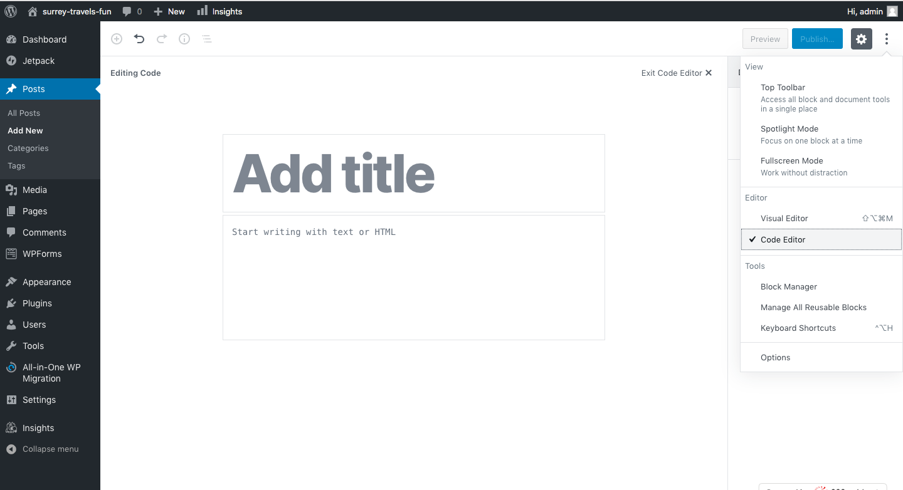

Your post can contain a bunch of different **block types**:
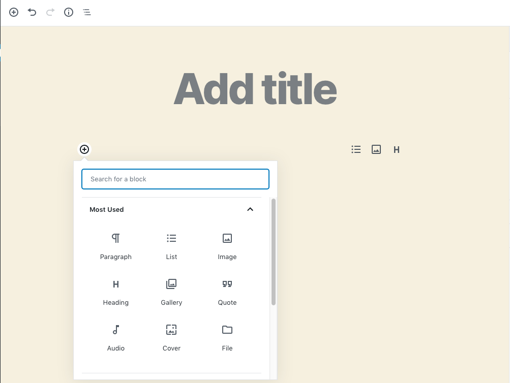

#### Pages
This is where you create and maintain all your Pages. Pages are different from blog posts because they will stay in one place and show up in the site navigation. 

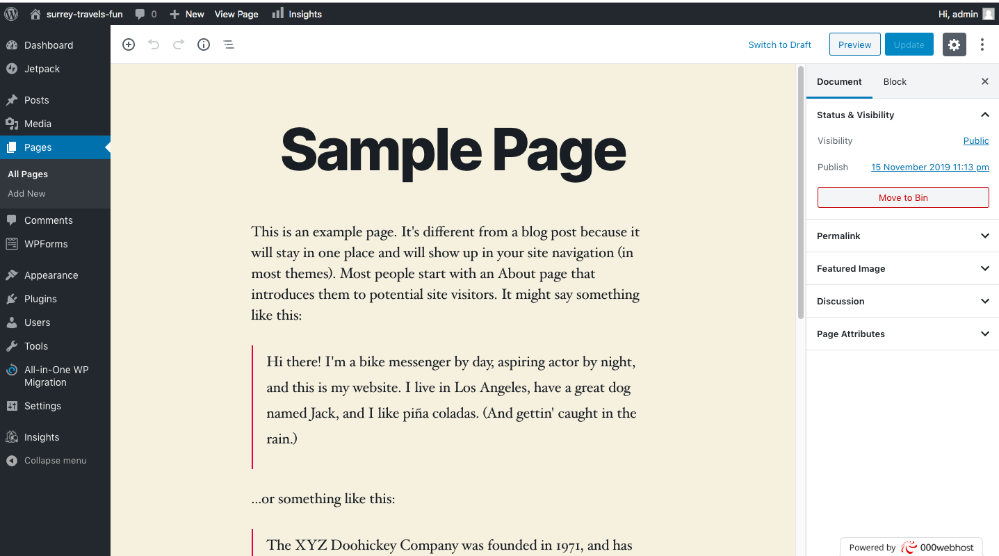

> Create an *About* page for your website

#### Comments
You can manage all your Comments within this section, including replying to comments or marking them as spam.

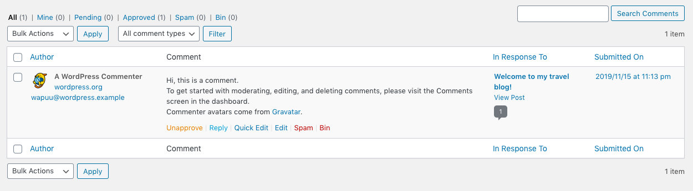

#### WPForms
Can use this to create custom forms on your webpages
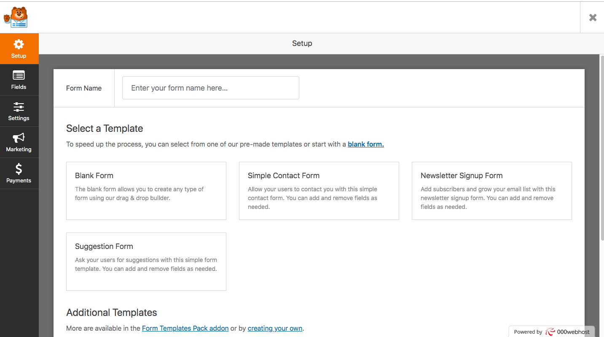

#### Plugins
Plugins extend and expand the functionality of WordPress. You can add or delete plugins within here as well as activate or deactivate them.

#### Users
This screen lists all the existing users for your site. Depending on your Role, you can also add new users as well as manage their Roles.

#### Tools
This section gives you access to various convenient tools. You can also Import data to your WordPress site or Export all your WordPress data to a file.

### Sample Travel Website Layout:

* Categories
  * Countries
  * Accommodations
  * Flights
  * Food
* Posts
  * Canada
  * India
  * Air Canada
  * Indian food
* Pages
  * Blog
  * About Me
  * Travel Deals
* WPForms
  * Subscribe to newsletter
