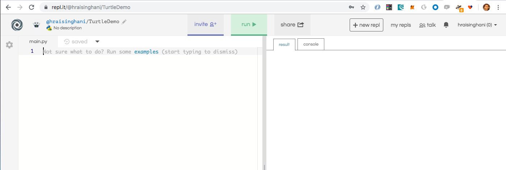

# Introduction to Python
Lesson run with accompanying PPT

### Goals
* Be familiar with some Python and general coding resources
* Understand the basics of Python code which includes:
  * Data structures
  * Random number generator
  * Loops
  * Functions
  * Pull everything together in a simple application

### Setup

> Have students sign onto https://tlk.io/learntocode which will be used for messaging.

> Have students create an account at https://repl.it/

### Python Basics using Turtle

* Ensure students have an account setup with https://repl.it/

> 1. Add a new repl and select `Python (with Turtle)`

> 2. Change the display name of the repl to something like `TurtleDemo`. The interface should look like:



**Let's take a look at this how this interface is setup. Key things to note:**

* Our code editor is a file called `main.py`. Here we write the code we want to run. 
* Notice the `run` button between the 2 main windows. This executes our code from `main.py`.
* In the right-hand window are 2 tabs:
  1. result - shows us the graphical output
  2. console - this displays any non-graphical code output. It's also interactive so I can write Python statements directly into it.  

> 3. Let us look at a simple `print("Hello world")` statement, both in our `main.py` file and in our console. `print()` in Python is a method which displays whatever is passed in between its parentheses. **Generally whenever you see the `()` being used (outside a function definition), it indicates a method or a function being called and anything in it is referred to as *passing in a parameter***  

> 4. Now let use a Turtle Graphics module which is a fun drawing tool for Python. We first need to import this library of code in order to use it. Write the following code:
```
import turtle

larry = turtle.Turtle()
larry.shape('turtle')
larry.color('green')
print(larry)
```
Here we:
* import the `turtle` library - this contains everything about turtles. It's the blueprints.

* we create a variable called `larry` and assign it `=` to this instance of a Turtle object. That's what `Turtle()` does. **Think of the `turtle` library as a set of blueprints to create turtle related things**. The `Turtle()` actually creates an instance of the Turtle object. We then assign a specific shape to the larry instance (it could be an arrow or circle/dot). That's what we see with the `print(larry)` statement. 

Now let's move our turtle instance, called `larry`. Q) What do you think this will do?
```
larry.forward(50)
```
Q) What are the units?

And then:
```
larry.left(90)
larry.forward(100)
larry.left(90)
larry.forward(100)
```

> Go ahead and complete the square. 
* Also:
```
larry.up()
larry.forward(100)
larry.down()
larry.forward(100)
larry.reset()
```

* Reference for other images: https://www.geeksforgeeks.org/turtle-programming-python/

* Let us try to create a circle with `larry.circle(100)`. Q:What does the 100 mean here? Ans: Radius. Q) What about `-100`? Have students figure this out by moving their cursor forward to get to the middle. 

> 5. Notice how much code repetition to complete the square. Q: What sort of tools would you expect Python to have to simplify our code? **Ans: Loops!**

* The `for` loop in Python takes the syntax of:
```
for <each item> in <some group of items>: //Note the colon and code indentation
    <do something>
```
* In Python, there is the `range(some_number)` function which gives you a list of numbers from 1 to `some_number`. Try the following in the console (we'll talk about lists a bit later)
```
print(range(4))
```

* If we want to run something 4 times, we can use the for loop as follows:
```
for i in range(4):
    print(i)
    larry.forward(100)
    larry.right(90)
```
* What values of `i` do we see? Why do we start with 0?

* The indenting tells Python that the indented commands belong to the loop after the `:`. 

* Now with the power of loops, we can make some really interesting patterns using very little code. Some code to try:
```
# Makes a double star
for i in range(8):
    larry.forward(100)
    larry.left(225)
```
* We can also use the fact that `i` increments every time the loop is run to add increments in our pattern.
```
# Make a maze
for i in range(10):
    larry.forward(10*i)
    larry.left(90)
```
**Note: If you don't want to wait for the entire trace, use `larry.speed(0)`.** This is helpful for the next few:

```
for i in range(50):
  larry.circle(i*3)
  larry.left(10)
```
* What if you make the range 100? How beautiful of a pattern do you get?!

* In our `circle()` method, we don't need to draw the entire circle. If we pass in `180` as the second argument, we can draw half-circles. 

```
for i in range(20):
    larry.circle(i*3, 180)
    larry.right(45)
```
* Change this from blue to red

* Go ahead and experiment with loops - try different shapes and repetitions!

```
# Cool spiral
for i in range(100):
    larry.forward(i*2)
    larry.circle(i*2, 90)
    larry.right(20)
```

### Random numbers
Python has a random number generator that makes creating programs such as these more interesting with less effort!

```
import random
```
* Then to use the random number generator, we have functions:
    * `random.randrange(start, finish)`
    * `random.choice(<some list>)`

* Adapt your shapes to use a random number for the size of the cicle.

* Also use a random color from a list of choices: `colors = ['blue', 'green', 'yellow', 'red']`

* Can also reposition starting point with `larry.goto(x,y)`


### Quick Overview of Python Data Types and Flow Control

Key Data Types to cover:
* Integers
* Strings (anything between `''`)
* Booleans
* Lists
    * Group of data types between `[ ]` separated by commas and indexed to 0 as we saw with the `range()` function. 
    * Try to get the 3rd item in the list. What's the index?
    * Can also apply functions on lists:
```
print(sum(range(4)))
```
* Dictionaries
    * { "one" : 1, "two" : 2}
    * Operate just like lists except they have set indicies or keys
    * Reference `key-value` pairs

#### Exercise:
* Create 2 python lists with the following vehicle weights:
```
cars - 4200, 3514, 2433, 3865
trucks - 5100, 5232, 4988, 4560
```
* Create a python dictionary with 2 keys: `cars` and `trucks` that have the value of the lists `cars` and `trucks` respectively.

* Print the total weight of cars
* Print the total weight of trucks
* Add 2 new keys: `total_weight_cars` and `total_weight_trucks` with their sums as values.


Flow control:
* Go through `for` statement in more detail and make sure participants understand the index/item.
* Example with a list
* `while` statement
* If/elif/else:
```
if <something>:
    //do this
elif <something>:
    //do that
else:
    //do something if all else fails

// Note the use of the 'break' keyword to exit any loop

a = 200
b = 33
if b > a:
  print("b is greater than a")
elif a == b:
  print("a and b are equal")
else:
  print("a is greater than b")
```

### Python Functions
* Functions are groups of code written to do certain tasks. Think of functions as a way to define your own command. 


* Syntax of a function:
```
def function_name(parameters):
    //statements(s)
    return <something> (optional)
```
* Keyword `def` marks the start of the function header `def function_name(parameters):`

* Parameters passed into the function are optional

* A `':'` marks the end of the function header
* A return statement is also optional

* Each function should be designed to do only 1 thing!

* Let's look at defining a function and actually calling it:

```
# Defining a function
def my_function():
    print("Hello everyone!")

# Calling a function (remember the parentheses!)
my_function()
```
* Q) Does the order of function definition and when it is called matter?

* Let's take our turtle example and create a function called `square()` which, when called, draws a square with a user defined width.
```
def make_square(size):
    for i in range(4):
        larry.forward(size)
        larry.left(90)

make_square(50)
make_square(100)
```

* Write a similar function for creating a circle with the radius as the parameter. 

<< Short break >>

### Rock Paper Scissors App

* Let's look at writing a complete Rock Paper Scissors Program from scratch using Python

* When we plan out a program like this, we actually write things out in normal human readable form, plan what we need, write out our business logic, and only then actually start writing code. **We call this psudo-code**.

* Key things to lay out:
    1. Types of players: human, computer
    2. Human player moves - user input
    3. Computer player moves - random selection from a list of moves
    4. Compare the moves - what are the possibilities
    ```
    r,r/r,s/r,p/s,r/s,s/s,p/p,r/p,s/p,p
    ```
    5. What are the possible outcomes?
     * Tie
     * Did the human win? From the human's perspective, the options are: (`pr, sp, rs`)
     * Did the computer win? (if the result is anything else)

    6. Tally score. Human vs. Computer

    7. Ability for human to break from the game with an entry like `q`

    ```
    import random

    player_score = 0
    computer_score = 0
    ties_score = 0
    allowed_moves = ['r', 'p', 's']
    winning_moves = ['pr', 'sp', 'rs']

    while True:
        player_move = input("What is your move?")
        computer_move = random.choice(allowed_moves)
        print('Your move', player_move)
        print('Computer move', computer_move)

        if player_move == 'q':
            break
        elif player_move == computer_move:
            print("Tie")
            ties_score += 1
        elif player_move + computer_move in winning_moves:
            print("You Win!")
            player_score += 1
        else:
            print("You Lose!")
            computer_score += 1
        print('Current Score: Player - ', player_score, 'Computer:', computer_score, 'Ties:', ties_score)
  ```
* How to I break up the code into functions such as:
    * `make_move()`
    * `determine_winner()`
    * `update_score()`

Note - this is more advanced so to start, just pick one action to turn into a function.

* What other improvements can we make? For example, can we prevent the human from entering in any random key?


